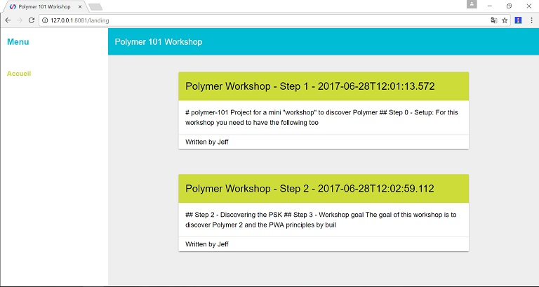
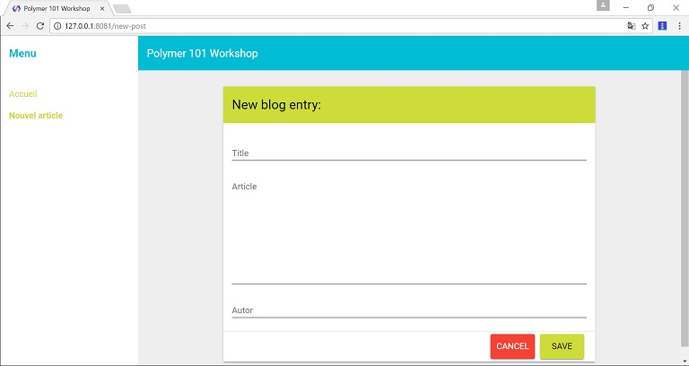
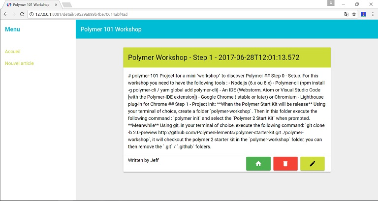

# polymer-101
Project for a mini "workshop" to discover Polymer  

## Setup:  
For this workshop you need to have the following tools :
- Node.js (6.x ou 8.x)
- Polymer-cli (npm install -g polymer-cli / yarn global add polymer-cli)
- An IDE (Webstorm, Atom or Visual Studio Code [with the Polymer-IDE extension])
- Google Chrome ( stable or later) or Chromium
- Lighthouse plug-in for Chrome

## Workshop goal
The goal of this workshop is to discover Polymer 2 and the PWA principles by building a Blog site.  
The REST API Backend is provided so we will not cover this part (source code available here on [github.com/JeffLeFoll/polymer-101-backend](https://github.com/JeffLeFoll/polymer-101-backend)).

### Objectives
In this workshop you will learn to:
- init a new Polymer 2 PWA
- create pages & components
- use the Fetch API and the iron-ajax component
- use the app-route component to navigate in your SPA 
- ...

### API
The REST API is located here [https://polymer-101-workshop.cleverapps.io/api/blogpost](https://polymer-101-workshop.cleverapps.io/api/blogpost) (unavailable outside workshop event, check the source code if you need it).  
The API exposes the folowing ressources: 
```
GET    / 
GET    /api/blogpost 
POST   /api/blogpost
PUT    /api/blogpost 
GET    /api/blogpost/:id
DELETE /api/blogpost/:id 
GET    /api/blogpost/autor/:name 
GET    /api/blogpost/:blogId/comment 
POST   /api/blogpost/:blogId/comment 
GET    /api/blogpost/:blogId/comment/:id 
DELETE /api/blogpost/:blogId/comment/:id
``` 

## Step 1 - Project init: 
**When the Polymer Start Kit will be release**  
Using your terminal of choice, create a folder `polymer-workshop`.  
Then in this folder execute the following command : `polymer init` and select the `Polymer 2 Start Kit` when prompted.

**Meanwhile**  
Using git, in your terminal of choice, execute the following command:  
`git clone -b 2.0-preview http://github.com/PolymerElements/polymer-starter-kit.git ./polymer-workshop`, it will checkout the polymer 2 starter kit in the `polymer-workshop` folder, you can then remove the `.git` / `.github` folders.

## Step 2 - Discovering the PSK

## Step 3 - The langing page  
We will start by creating a page that list all the Blog Post's and limit the article displayed to 140 characters.  


## Step 4 - Writing new blog post
In this step we will create a new page, to write a new blog post and come back to the landing page with the newly post displayed.  


## Step 5 - Displaying the blog post details
Now we can display a list of blog post, we can write new one.  
Lets create a page to display the details of a blog post.  
We will also let the user edit this blog entry.  


