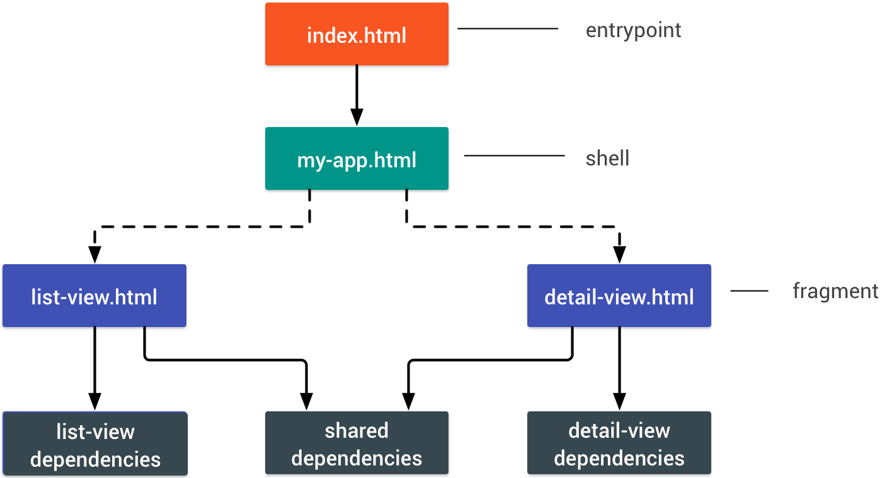

# polymer-101
A workshop to discover Polymer 2 and some PWA principles.

## Setup:  
For this workshop you need to have the following tools :
- Node.js (6.x or 8.x)
- Polymer-cli (npm install -g polymer-cli / yarn global add polymer-cli)
- An IDE (Webstorm, Atom or Visual Studio Code [with the Polymer-IDE extension])
- Google Chrome ( stable or later) or Chromium
- Lighthouse plug-in for Chrome

## Workshop goal
The goal of this workshop is to discover Polymer 2 and the PWA principles by building a Blog site.  
The REST API Backend is provided so we will not cover this part (source code available here on [github.com/JeffLeFoll/polymer-101-backend](https://github.com/JeffLeFoll/polymer-101-backend)).

### Objectives
In this workshop you will learn to:
- init a new Polymer 2 PWA
- create pages & components
- use the Fetch API and the iron-ajax component
- use the app-route component to navigate in your SPA 
- ...

### API
The REST API is located here [https://polymer-101-workshop.cleverapps.io/api/blogpost](https://polymer-101-workshop.cleverapps.io/api/blogpost) (unavailable outside workshop event, check the source code if you need it).  
The API exposes the folowing ressources: 
```
GET    / 
GET    /api/blogpost 
POST   /api/blogpost
PUT    /api/blogpost 
GET    /api/blogpost/:id
DELETE /api/blogpost/:id 
GET    /api/blogpost/autor/:name 
GET    /api/blogpost/:blogId/comment 
POST   /api/blogpost/:blogId/comment 
GET    /api/blogpost/:blogId/comment/:id 
DELETE /api/blogpost/:blogId/comment/:id
``` 

## Short note: Project init
**When the Polymer Start Kit will be released**  
Using your terminal of choice, create a folder `polymer-workshop`.  
Then in this folder execute the following command : `polymer init` and select the `Polymer 2 Start Kit` when prompted.

**Meanwhile**  
Using git, in your terminal of choice, execute the following command:  
`git clone -b 2.0-preview http://github.com/PolymerElements/polymer-starter-kit.git ./polymer-workshop`, it will checkout the polymer 2 starter kit in the `polymer-workshop` folder, you can then remove the `.git` / `.github` folders.

## Smaller note :)  
When starting a new step, please do a `bower install` in the step folder.

## Quick note on the polymer-cli  
The polymer cli is a very powerfull tool.  
By running the `polymer serve` command, you will be able to serve your sources to `127.0.0.1:8081`.  
The `polymer build` command will build your application following the build configuration of your `polymer.json`.  
Finaly, you can serve the result of your build with the `polymer serve build/default` command. (replace the 'default' with the name specified in the `polymer.json`: 'es6-unbundle', 'es5-bundle' or custom one, or 'default' if you didn't use preset and didn't give a name).

## Step 1 - Discovering the Polymer-Starter-Kit
Here is the result of the above git clone (30/06/2017).  
Take a moment to discover the PSK:
- polymer.json => All the infos needed by the polymer cli to build your app
- sw-precache-config.js => configuration file to generate your service worker (who will, among other thing, take care of the cache)
- manifest.json => the manifest describe your Progressive Web App
- index.html => your PWA entry point
- test => your unit test folder
- src => your source folder
- src/my-app.html => your application's shell: top-level app logic, router, and so on.  



## Step 2 - The langing page - part 1
We will start by creating a page that list all the Blog Post's.  
We will retrieve the data making a GET request on[https://polymer-101-workshop.cleverapps.io/api/blogpost](https://polymer-101-workshop.cleverapps.io/api/blogpost) (using the Fetch API).  

The data will be displayed in a [`paper-card` element](https://www.webcomponents.org/element/PolymerElements/paper-card)
(in your terminal do a `bower i --save paper-card`)

## Step 3 - The langing page - part 2  
Now that we have some data we will do some refactoring.
To avoid that our page start to do to much things (fetching the data, handling its display, ...) we will start some refactoring.  
We will extract the display part in a new component called `blog-article-lite`.  
In the same time we will also add some "logic" by limiting the article text to 140 characters.  


## Step 4 - Writing new blog post
In this step we will create a new page, to write a new blog post.  
To do that we will use the Fetch API to do POST request on the backend. 
Then we will use the [`app-route` component](https://www.webcomponents.org/element/PolymerElements/app-route) to come back to the landing page with the newly post displayed.    
We will also use the following components :
- [`paper-input` component](https://www.webcomponents.org/element/PolymerElements/paper-input)
- [`paper-textarea` component](https://www.webcomponents.org/element/PolymerElements/paper-input)
- [`paper-button` component](https://www.webcomponents.org/element/PolymerElements/paper-button)


## Step 5 - Displaying the blog post details
Now, we can display a list of blog post and we can write new one.  
Lets create a page to display the details of a blog post.  
For that we will dive a lot 'deeper' in the [`app-route` component](https://www.webcomponents.org/element/PolymerElements/app-route).
We will also let the user edit this blog entry.  
To do that, instead of using the Fetch API to perform a GET reqest on the backend to retrieve the post's data, we will use the [`iron-ajax` component](https://www.webcomponents.org/element/PolymerElements/iron-ajax).  
Finaly we will use [`iron-icon` component](https://www.webcomponents.org/element/PolymerElements/iron-icon) and [`iron-icons` component](https://www.webcomponents.org/element/PolymerElements/iron-icons) to add some icons on our button instead of text.  

In the landing page we will also add a [`paper-button` component](https://www.webcomponents.org/element/PolymerElements/paper-button) surronded by a link to navigate to the newly created detail page.


